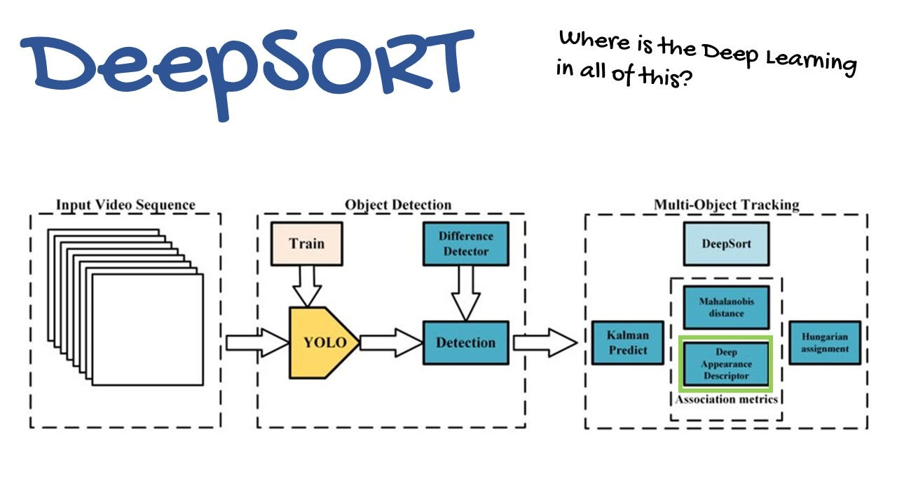

# Object-Tracking-PyTorch-YOLOv5-DeepSort

This repo represents implimentation of YOLOv5 and DeepSort in Pytorch for object tracking

# Watch Demo:


# How to Run ?

1. Create your virtual envronment using python 3.7 

```bash
conda create -p tracking python=3.7 -y
```

2. Activate the environment

```bash
source activate tracking/
```

3. Run each commands of Commands.txt on terminal

```bash
follow Commands.txt 
```

4. After running last command of Commands.txt which is running the detection file with pre-trained model
yolov5s.pt, it will create folder with name runs and our tracked video will be present in it with different experiment folder (runs/detect/exp/tracked videos).


# Source:

1. yolov5 github repo for object tracking and capturing the object info like coordinates, object class and confidence score.
```bash
https://github.com/ultralytics/yolov5
``` 

2. deep_sort_pytorch github repo for multiple tracking:

```bash
https://github.com/ZQPei/deep_sort_pytorch
``` 

# Workflow of deep sort algorithm.

In this object tracking project first of all object detection happens with object detection models(here using yolov5s.pt from yolov5 [model zoo](https://github.com/ultralytics/yolov5)), which give information about the object which it detects. In the object information it gives object class type (person, cat, dog, fruite etc), its confidence score, and its coordinates.

These coordinates then will be feed to deep sort model. Deep sort model will do corelation (with hungarian algorithm) with its already trained classes with the coordinate and classes information of detection model and then tracked the object in the video. 
If deep sort model found negative corelation with the detection model info and its classes info then it don't tracked. By negative corelation here means that the deep sort model is not trained on the object which is detected by the detection model.




